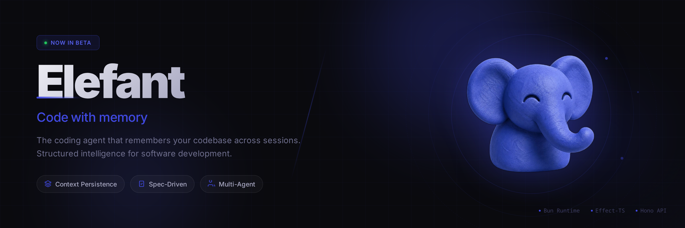
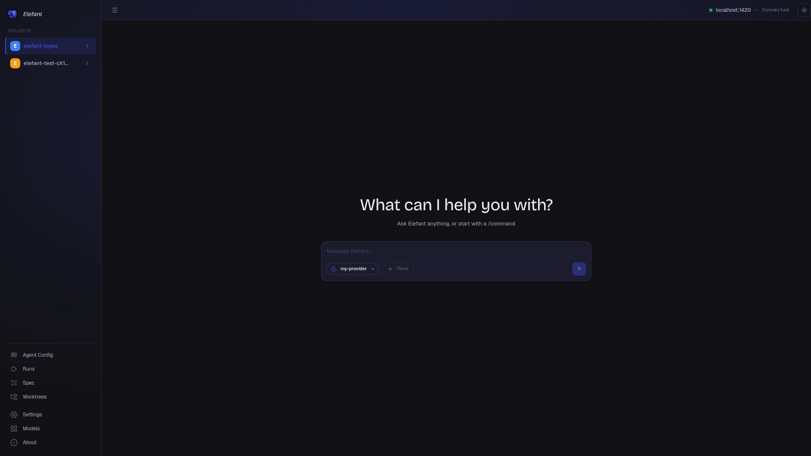
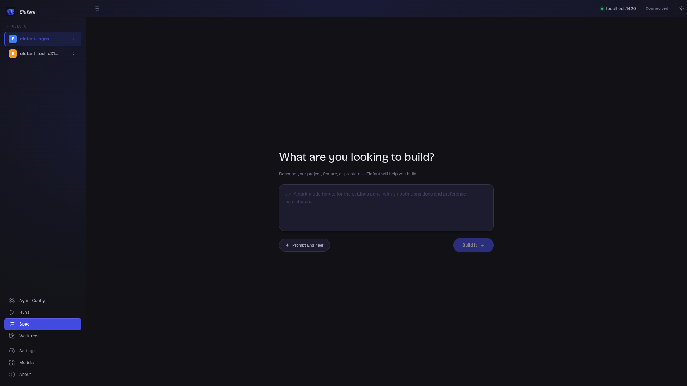
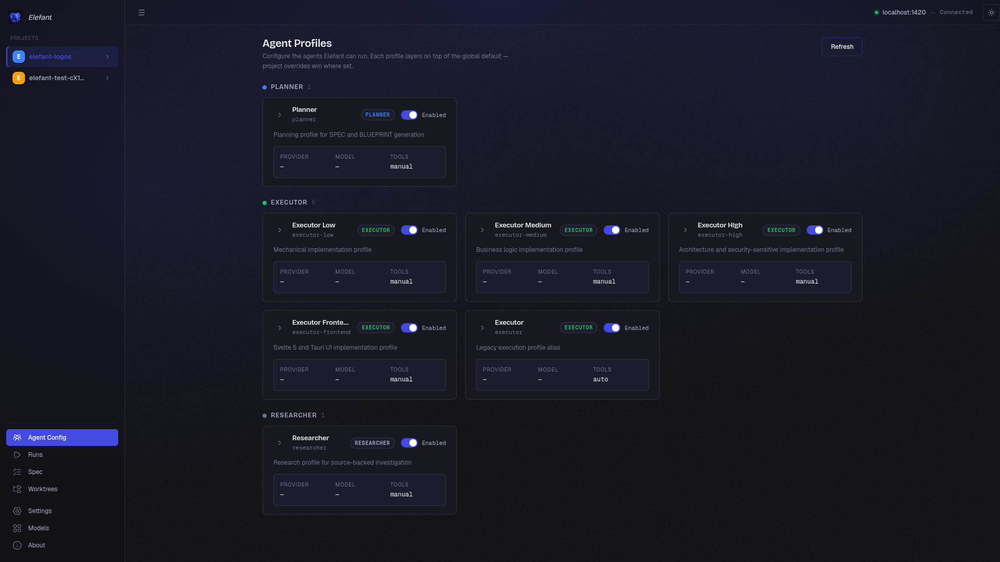
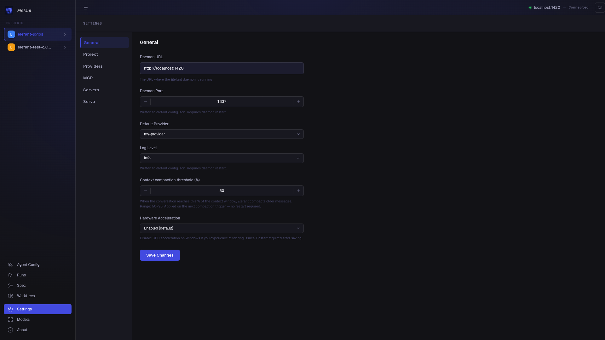

# Elefant

**Open-source AI coding agent platform by [Pulsyn](https://getpulsyn.com).**

Bun-native daemon · SQLite-backed state · Hook-enforced behavior · Tauri + Svelte 5 desktop app

---



---

## What it does

Elefant runs a local daemon that manages AI coding sessions across your projects. Point it at a folder, pick a model, and start building. No cloud account required, no data leaving your machine.

**Spec Mode** is the key differentiator. Instead of free-form chat, you describe what you want to build and Elefant runs a structured workflow: discovery interview → locked specification → wave-based execution → verification. Thirteen specialist agents handle planning, implementation, research, debugging, and verification — each with a configurable model.

---

## Screenshots

### Chat



### Spec Mode



### Agent Profiles



### Settings



---

## Quick start

**Prerequisites:** [Bun](https://bun.sh) >= 1.3, Git

```bash
git clone https://github.com/pulsynlabs/elefant.git
cd elefant
bun install
bun run dev          # daemon, watch mode
```

```bash
# Desktop app (separate terminal)
cd desktop
bun install
bun run tauri:dev
```

The daemon runs on `localhost:1337`. The desktop connects automatically.

---

## Spec Mode

```
/spec-quick <task>     fast-track a small change
/spec-discuss          full discovery interview
```

Or use the Spec panel in the sidebar for a GUI-driven workflow.

[→ Spec Mode docs](docs/spec-mode/README.md)

---

## Tech stack

| Layer | Tech |
|---|---|
| Daemon | Bun + Elysia |
| Database | SQLite (WAL, per-project) |
| Desktop | Tauri v2 + Svelte 5 |
| Styling | Tailwind v4 |
| Types | TypeScript strict mode |
| Testing | Bun test + Playwright |

---

## Project layout

```
elefant/
├── src/
│   ├── daemon/        entry point, server lifecycle
│   ├── state/         state manager, migrations
│   ├── db/            SQLite repositories
│   ├── tools/         tool registry (includes 11 spec_* tools)
│   ├── hooks/         permission:ask · tool:before · context:transform
│   ├── permissions/   orchestrator gate
│   ├── compaction/    context compaction manager
│   └── agents/        13 agent prompts + 15 slash commands
│
├── desktop/           Tauri app
│   └── src/
│       ├── lib/       API clients, stores, components
│       └── features/  chat · spec-mode · settings · models
│
└── docs/              architecture, spec-mode reference, ADRs
```

---

## Running tests

```bash
bun test                          # daemon test suite
bun run typecheck                 # TypeScript strict check
bun run validate:prompts          # agent prompt validation
cd desktop && bunx playwright test  # E2E (mobile + desktop)
```

---

## CLI

```bash
bun run start    # start daemon
bun run stop     # stop daemon
bun run status   # daemon status
```

---

## Design principles

- **Hook-first enforcement** — guardrails live in hooks, not prompts. They survive model drift.
- **DB-backed state** — spec mode state is in SQLite, not markdown files scattered in your repo.
- **Daemon owns state** — the desktop is a view. CLI and MCP go through the same API.
- **Provider-agnostic** — each agent role can use a different model from any provider.
- **Zero footprint** — projects not using Spec Mode see no behavior change.

---

## About Pulsyn

Elefant is built by [Pulsyn](https://getpulsyn.com) — the team behind the Pulsyn Rune 1, a privacy-first smart ring with on-device AI. Both products share the same core belief: your compute and your data should stay with you.

---

## License

MIT
